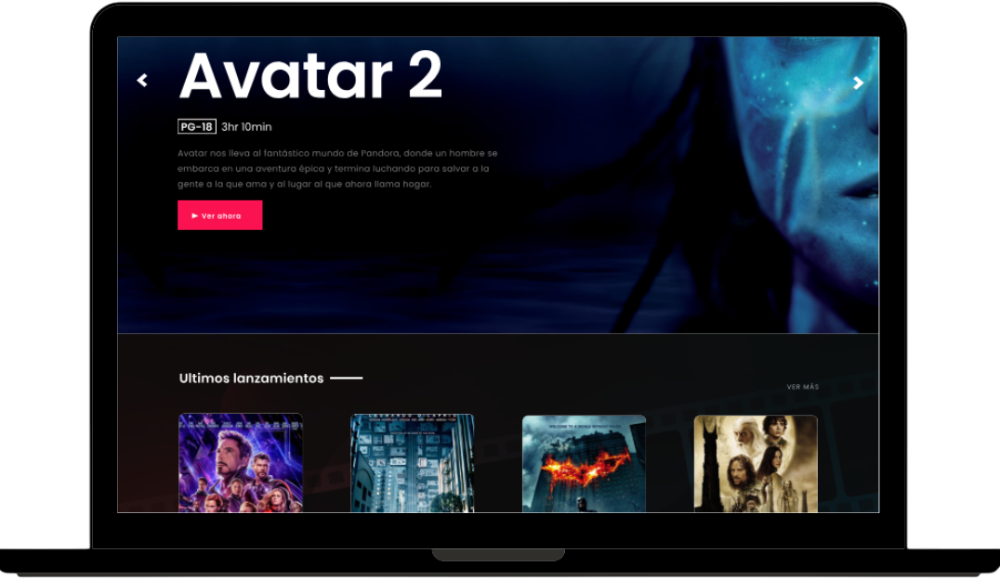

  

Esta es una sencilla página de aterrizaje que muestra películas. Utiliza datos JSON codificados en el código para mostrar la información de las películas y utiliza iconos y el framework de Bootstrap.

## Características

- Muestra una lista de películas con sus detalles.
- Próximas Películas y Próximos Lanzamientos destacados.
- Utiliza iconos de Bootstrap para mejorar la presentación visual.
- Diseño adaptable con el framework de Bootstrap.

## Figma

- Diseño del Proyecto en Figma: [Enlace a Figma](https://www.figma.com/file/eGm2BsDuliIwUYXOSvRLM3/Codo-a-Codo-(Grupo-15)?type=design&node-id=0%3A1&mode=design&t=emQ1mbtgAqoNVZgI-1)

## Vista Previa

  

## Tecnologías Utilizadas

- HTML
- CSS (Bootstrap)
- JavaScript
- Iconos de Bootstrap

## Créditos

- Iconos de Bootstrap: [Iconos de Bootstrap](https://icons.getbootstrap.com/)
- Framework de Bootstrap: [Bootstrap](https://getbootstrap.com/)

## Licencia

Este proyecto está bajo la Licencia MIT - consulta el archivo [LICENSE](LICENSE) para más detalles.